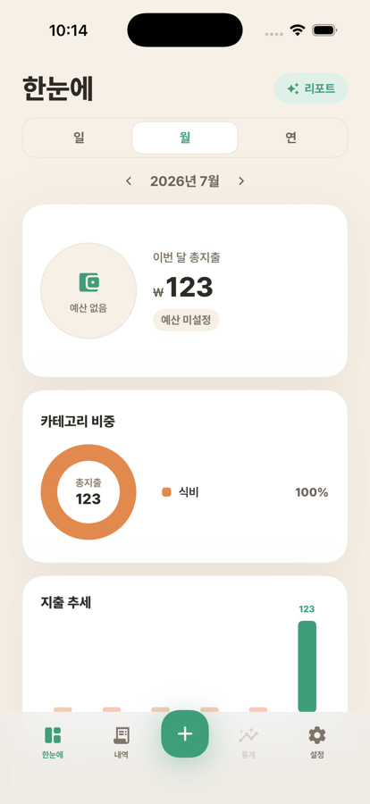

<div align="center">


# WadeMoney

**적는 데 3초, 보는 데 3초 — 온디바이스 AI 가계부**

SwiftUI · SwiftData + CloudKit · WidgetKit · Apple FoundationModels · iOS 26+

</div>

---

## 소개

WadeMoney는 "빠르게 적고, 한눈에 본다"에 집중한 개인 가계부 iOS 앱입니다.
지출 기록은 키패드 몇 번의 탭으로 끝나고, 대시보드는 이번 달 예산·카테고리 비중·지출 추세를
한 화면에 보여줍니다. 메모 다듬기와 월간 소비 리포트는 Apple의 온디바이스 파운데이션 모델로
생성되므로 **가계부 데이터가 기기 밖(서드파티 서버)으로 나가지 않습니다.**

<div align="center">

</div>

## 주요 기능

- **한눈에 대시보드** — 일/월/연 기간 전환, 예산 진행 링, 카테고리 비중 도넛(상위 5 + 기타),
  지출 추세 바 차트, 전월 동일 시점 대비 페이스 비교와 이번 달 예상 지출(프로젝션)
- **빠른 입력** — 전용 키패드로 금액 입력 → 카테고리 선택 → 저장까지 한 시트에서.
  지출/수입 전환, 기존 거래 수정·삭제 지원
- **AI 메모 다듬기** — 갈겨 쓴 메모를 온디바이스 모델이 정리하고 어울리는 카테고리를 추천
- **AI 월간 리포트** — 요약 문장·절약 팁·카테고리 증감(지난달 대비)을 온디바이스에서 생성.
  숫자는 즉시 표시되고 AI 문장은 캐시/프리웜으로 빠르게 채워집니다
- **위젯** — 홈 화면 요약(오늘 지출 + 예산 잔액), 카테고리 칩 딥링크로 바로 기록하는
  빠른 기록 위젯, 잠금 화면 예산 위젯(원형·인라인)
- **월 시작일 설정** — 월급일 기준(1~28일)으로 "나의 한 달"을 정의, 예산·통계가 모두 따라감
- **iCloud 동기화** — SwiftData + CloudKit 프라이빗 DB로 기기 간 자동 동기화
  (중복 시드·중복 설정 행은 결정적으로 자동 치유)
- **CSV 내보내기** — 전체 내역을 공유 시트로 내보내기(스프레드시트 수식 인젝션 방어 포함)

## 프라이버시

- AI 기능은 전부 **온디바이스**(Apple FoundationModels) — 외부 AI 서버 호출 없음
- 데이터는 기기와 사용자의 iCloud 프라이빗 데이터베이스에만 저장
- 추적 없음 · 수집 데이터 없음 (`PrivacyInfo.xcprivacy` 선언)

## 아키텍처

```
WadeMoney/
├── WadeMoneyCore/            # 순수 Swift 도메인 엔진 (SPM 패키지, UI/DB 의존성 없음)
│   ├── Period / YearMonth    #   월 시작일 기반 회계 기간 계산
│   ├── Aggregator            #   기간·카테고리별 집계
│   ├── BudgetBook            #   월 예산 장부 (일/월/연 환산)
│   ├── PaceCalculator        #   전기간 동일 시점 페이스 비교
│   ├── Projection / Donut    #   지출 예측, 도넛 슬라이스 병합
│   └── Tests/                #   Swift Testing 단위 테스트
├── WadeMoney/                # 앱 타깃 (SwiftUI)
│   ├── Models / Persistence  #   SwiftData 모델, CloudKit 컨테이너, 시더
│   ├── Stores                #   LedgerRepository·SettingsStore (도메인 엔진 ↔ SwiftData)
│   ├── Screens               #   대시보드·빠른입력·내역·설정·카테고리·AI 리포트
│   ├── AI                    #   FoundationModels 어댑터 (인사이트·메모 다듬기·리포트)
│   └── DesignSystem          #   컬러·타이포(Pretendard)·아이콘(Material Symbols) 토큰
├── WadeMoneyWidgetsExtension/ # WidgetKit 확장 (App Group으로 데이터 공유)
├── WadeMoneyTests/            # 앱 레이어 단위 테스트
└── WadeMoneyUITests/          # XCUITest E2E (핵심 루프 자동 검증)
```

핵심 설계: 돈 계산(기간·예산·집계·예측)은 전부 `WadeMoneyCore`의 순수 함수로 격리되어
시뮬레이터 없이 밀리초 단위로 테스트됩니다. 앱 레이어는 SwiftData 영속성과 화면 상태만 다룹니다.

## 빌드

요구 사항: **Xcode 26+**, [XcodeGen](https://github.com/yonaskolb/XcodeGen)

```bash
brew install xcodegen
xcodegen generate
open WadeMoney.xcodeproj
```

> 프로젝트 파일(`.xcodeproj`)은 `project.yml`에서 생성됩니다. 타깃/설정 변경은 `project.yml`을 수정하세요.
> CloudKit·App Group 엔타이틀먼트는 사용 불가 환경(서명 없는 시뮬레이터)에서 자동으로 로컬 저장소로 폴백합니다.

## 테스트

```bash
# 도메인 엔진 (빠름, 시뮬레이터 불필요)
cd WadeMoneyCore && swift test

# 앱 단위 테스트
xcodebuild test -project WadeMoney.xcodeproj -scheme WadeMoney \
  -destination 'platform=iOS Simulator,name=iPhone 17 Pro' -only-testing:WadeMoneyTests

# E2E UI 테스트 (실행 → 지출 기록 → 저장 → 내역 반영 검증)
xcodebuild test -project WadeMoney.xcodeproj -scheme WadeMoneyUITests \
  -destination 'platform=iOS Simulator,name=iPhone 17 Pro'
```

## 크레딧

- 서체: [Pretendard](https://github.com/orioncactus/pretendard)
- 아이콘: [Material Symbols Rounded](https://fonts.google.com/icons)
